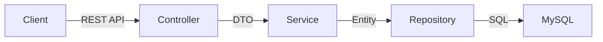

# Workshift Management System

> **Hệ thống Quản lý Phân ca & Đăng ký Lịch làm việc Đa chi nhánh (Multi-Group Workshift Management)**


## 📖 Giới thiệu

**Workshift Management System** là giải pháp phần mềm toàn diện dành cho các chuỗi cửa hàng, quán cafe, nhà hàng (F&B) để giải quyết bài toán quản lý lịch làm việc cho nhân viên bán thời gian (part-time).

Hệ thống được thiết kế theo mô hình **Multi-tenancy (Logic)**, cho phép một người dùng có thể tham gia nhiều cửa hàng (Group) với các vai trò khác nhau (Quản lý hoặc Nhân viên), đảm bảo dữ liệu được cách ly và bảo mật tuyệt đối giữa các nhóm.

---

## 🚀 Tính năng nổi bật

### 🌟 Dành cho Quản lý (Manager)
- **Quản lý Đa chi nhánh**: Tạo và quản lý nhiều nhóm (cửa hàng) trên cùng một tài khoản.
- **Cấu hình Ca linh hoạt**: 
    - Tạo vị trí làm việc (Pha chế, Thu ngân, Bảo vệ...).
    - Tạo **Ca mẫu (Shift Template)** để lên lịch nhanh chóng.
    - Thiết lập nhu cầu nhân sự cho từng ca.
- **Phân ca thông minh**:
    - Duyệt đơn đăng ký của nhân viên.
    - **Gợi ý nhân sự**: Hệ thống tự động tìm nhân viên phù hợp dựa trên lịch rảnh và vị trí.
    - Cảnh báo các ca thiếu người.
- **Kiểm soát chặt chẽ**: Khóa ca (Lock) trước giờ làm, xử lý yêu cầu đổi ca.

### 🌟 Dành cho Nhân viên (Member)
- **Đăng ký chủ động**: Xem lịch tuần và đăng ký các ca còn trống.
- **Khai báo lịch rảnh (Availability)**: Cập nhật khung giờ rảnh theo tuần để nhận gợi ý ca phù hợp.
- **Lịch cá nhân**: Theo dõi lịch làm việc đã được duyệt.
- **Đổi ca linh hoạt**: Gửi yêu cầu đổi ca hoặc hủy ca khi có việc đột xuất (tuân thủ quy định thời gian).

---

## 🛠 Kiến trúc & Công nghệ

Dự án được xây dựng theo kiến trúc **Layered Architecture** chuẩn Enterprise, đảm bảo tính mở rộng và dễ bảo trì.

### Backend (`workshift-backend`)
- **Core**: Java 17, Spring Boot 3.x/4.x
- **Database**: MySQL 8.0+
- **ORM**: Spring Data JPA
- **Security**: Spring Security (JWT / Session)
- **Validation**: Hibernate Validator
- **Build Tool**: Maven

### Frontend (`workshift-frontend`)
- **Core**: React 19, Vite 7
- **Language**: JavaScript (ES6+)
- **HTTP Client**: Axios (với Interceptors)
- **Styling**: CSS Modules / Tailwind CSS
- **Routing**: React Router DOM

### Mô hình Phân lớp (Backend)


---

## 📂 Cấu trúc dự án

```
workshift-management/
├── workshift-backend/       # Spring Boot Server
│   ├── src/main/java/com/workshift/backend/
│   │   ├── config/          # Cấu hình hệ thống (Security, CORS...)
│   │   ├── controller/      # API Endpoints
│   │   ├── service/         # Business Logic
│   │   ├── repository/      # Data Access Layer
│   │   ├── entity/          # Database Models
│   │   ├── dto/             # Data Transfer Objects
│   │   ├── mapper/          # Entity <-> DTO Mapping
│   │   └── exception/       # Global Error Handling
│   └── src/main/resources/  # Config files (application.yaml)
│
└── workshift-frontend/      # React Client
    ├── src/
    │   ├── api/             # API Service functions
    │   ├── components/      # Reusable UI Components
    │   ├── pages/           # Screen/Page Components
    │   ├── hooks/           # Custom React Hooks
    │   └── contexts/        # Global State Management
    └── ...
```

---

## 🏁 Hướng dẫn Cài đặt & Chạy (Quick Start)

### Yêu cầu hệ thống
- **Java JDK 17** trở lên.
- **Node.js 18** (LTS) trở lên.
- **MySQL 8.0** trở lên.

### Bước 1: Clone dự án
```bash
git clone https://github.com/your-username/workshift-management.git
cd workshift-management
```

### Bước 2: Thiết lập Backend

1. Di chuyển vào thư mục backend:
```bash
cd workshift-backend
```
2. Tạo file cấu hình từ mẫu:
```bash
cp .env.example .env
```
(Trên Windows CMD: `copy .env.example .env`)

3. Mở file `.env` và cập nhật thông tin Database (nếu cần):
```properties
DB_URL=jdbc:mysql://localhost:3306/your_name_db
DB_USER=your_username
DB_PASS=your_password
```
4. Chạy ứng dụng:
```bash
./mvnw spring-boot:run
```

### Bước 3: Thiết lập Frontend

1. Di chuyển vào thư mục frontend:
```bash
cd workshift-frontend
```
2. Tạo file cấu hình từ mẫu:
```bash
cp .env.example .env
```
(Trên Windows CMD: `copy .env.example .env`)

3. Cài đặt thư viện & Chạy:
```bash
npm install
npm run dev
```
> Client sẽ khởi động tại: `http://localhost:5173`

---

## 📚 Tài liệu API (Tóm tắt)

Hệ thống cung cấp RESTful API chuẩn. Dưới đây là các nhóm API chính:

| Nhóm | Endpoint | Mô tả |
| :--- | :--- | :--- |
| **Auth** | `POST /api/v1/auth/register` | Đăng ký tài khoản mới |
| | `POST /api/v1/auth/login` | Đăng nhập hệ thống |
| **Group** | `POST /api/v1/groups` | Tạo nhóm (Quán) mới |
| | `GET /api/v1/groups/my` | Lấy danh sách nhóm đã tham gia |
| **Shift** | `POST /api/v1/groups/{id}/shifts` | Tạo ca làm việc (Manager) |
| | `GET /api/v1/groups/{id}/shifts` | Lấy danh sách ca làm việc |
| **Reg** | `POST /api/v1/registrations` | Đăng ký ca làm (Member) |
| | `PUT /api/v1/registrations/{id}/status` | Duyệt/Từ chối đăng ký (Manager) |

*(Chi tiết đầy đủ xem trong tài liệu kỹ thuật nội bộ)*

---

## 📄 License

Dự án này thuộc sở hữu nội bộ. Mọi hành vi sao chép, phân phối lại mà không có sự cho phép đều bị nghiêm cấm.
